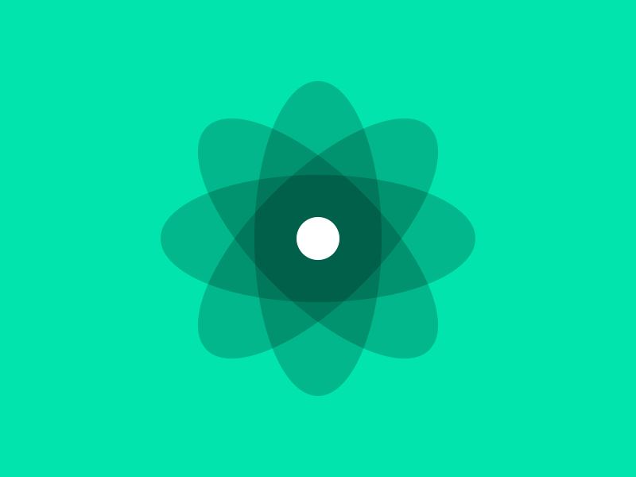

# react-g

[](https://circleci.com/gh/Geebrox/react-g)

Simple and powerful boilerplate for react projects



## Getting started

```bash
# 1. Clone the repository.
git clone https://github.com/Geebrox/react-g.git new-react-project

# 2. Go to new-react-project folder.
cd new-react-project

# 3. Install dependencies using yarn (https://yarnpkg.com/lang/en/docs/install)
yarn

# 4. To start dev server use:
yarn dev

# 5. To build project use:
yarn build
```
